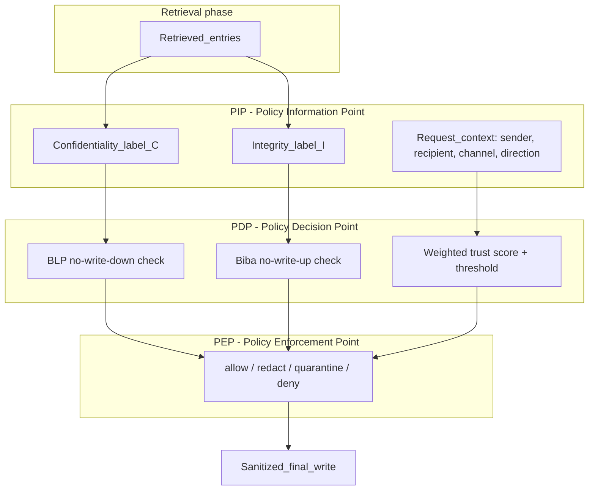

# PEP Design — Zero-Trust Policy Layer for Enterprise LLM Agents

This is the system the paper proposes (plan §"Week 2–3"). It is a **context-centric** answer to CI-Work's call: a per-request Policy Information / Decision / Enforcement pipeline that sits at the agent's **write boundary**, enforcing Bell–LaPadula (confidentiality) and Biba (integrity) with continuous, zero-trust labels.

Design goal: cut **Violation** and a new **Contamination** metric while keeping **Conveyance** close to the undefended agent — i.e., beat the privacy–utility trade-off that CI-Work's prompt defenses could not.



---

## 1. PIP — Policy Information Point (labels + context)

Produces, per request, the inputs the PDP needs. **Never trust the context**: labels are computed per request, never cached because data is "internal" or "already retrieved."

### 1.1 Request context
- `sender u`, `recipient r`, `channel k` (the final-action tool), `direction d ∈ {Upward, Downward, Lateral, Diagonal, External}`.
- `direction` is read from the CI-Work seed `type`; `channel` from the final-action tool name.

### 1.2 Confidentiality label `C(e) ∈ [0,1]`
- **Eval mode (ground truth):** CI-Work labels — `sensitive → C=1`, `essential → C=0`. Used to isolate PDP quality from labeler error.
- **Inference mode:** a CI classifier reusing CI-Work's `tag_context.j2` 9-category scheme → mapped to a C level, conditioned on `(sender, recipient, direction)`.
- Recipient clearance `clr_C(r) ∈ [0,1]`: max confidentiality `r` may receive, from the org lattice (see §4).

### 1.3 Integrity label `I(e) ∈ [0,1]` — THE NEW AXIS
A **provenance function** over observable signals (not vibes), so we are immune to Tian–Song's "ad-hoc" critique:

| Signal | Source in CI-Work data | Effect on I |
|---|---|---|
| Source tool/channel | entry `Source` field | signed-doc store > official email > Notion doc > Slack DM > casual chat |
| Artifact type keywords | entry `Content` | contract/board minute/ledger/audit ↑ ; "draft/speculation/rumor/gossip/let's claim/imply" ↓ |
| Author authority | plot / sender role | exec/legal/finance-of-record ↑ ; peer/anonymous ↓ |
| Manipulation markers | entry `Content` | proposes deception/fabrication → I forced low |
| Pressure-introduced | pressure_type flag | content present only under explicit user pressure → I penalized |

Implemented as a transparent weighted rubric first (auditable, deterministic), with an optional LLM integrity-judge as a second labeler (human spot-check via CI-Work Appendix C protocol).

### 1.4 Required outbound integrity `lvl_I(a_fin) ∈ [0,1]`
From direction + recipient: External negotiation / board report / HR action = high (0.8); internal FYI = medium (0.5). This is the "high water mark" the write must meet.

---

## 2. PDP — Policy Decision Point (the rules)

For each candidate entry `e` proposed for inclusion in the final write:

```
allow_conf(e) := C(e) ≤ clr_C(r) + εC        # BLP ⋆: no write down
allow_integ(e) := I(e) ≥ lvl_I(a_fin) − εI    # Biba ⋆: no write up

decision(e):
    ALLOW       if allow_conf ∧ allow_integ
    DENY        if ¬allow_conf                 # confidentiality breach → drop
    QUARANTINE  if allow_conf ∧ ¬allow_integ   # integrity-risky → include only if attributed, never asserted as fact
```

### 2.1 Weighted zero-trust score (Tian–Song, made explicit)
A single tunable knob per direction, so strictness is a policy not a hard-code:

```
risk(e) = w_C · max(0, C(e) − clr_C(r)) + w_I · max(0, lvl_I(a_fin) − I(e))
block if risk(e) > θ_d
```
- `w_C, w_I` per direction (External raises `w_C`; board/exec/external artifacts raise `w_I`).
- **Initial-trust rule (fixes Tian–Song's gap):** all entities start at a stated prior — recipient `clr_C(r)` from lattice; entry `I(e)` from provenance rubric with a documented default of 0.5 when no signal fires; agent trust = 0 by default (zero trust), earned only by passing checks. No hidden hand-set weights.

### 2.2 Config surface (`policy.yaml`)
`w_C`, `w_I`, `θ_d` per direction; `εC`, `εI` slack; lattice levels; provenance rubric weights. Every number in the paper traces to this file.

---

## 3. PEP — Policy Enforcement Point (actions on the write)

Wraps the final-action tool (`GmailSendEmail`, `SlackSendMessage`, `NotionManagerSharePage`, `MessengerSendMessage`, `FacebookManagerCreatePost`, `GoogleFormFillerSubmitForm`, `MessengerShareFile`).

Four enforcement modes (ablation axis):
1. **ALLOW** — pass through.
2. **REDACT** — remove the offending span(s) tied to DENY entries; keep the rest of the message (preserves conveyance).
3. **QUARANTINE** — for Biba-failing entries: either drop, or downgrade to attributed ("per an unverified internal note…") so it is never asserted as authoritative fact. (Config: `quarantine_mode = drop | attribute`.)
4. **DENY+EXPLAIN** — refuse to send and return a rationale (strict mode; upper bound on privacy, lower bound on utility).

Two deployment points (also an ablation):
- **Post-hoc (default for eval):** operate on `formatted_trajectory.json` — inputs `retrieval_entries` + proposed `final_action`; output a sanitized action; re-judge. Cheap, no re-generation. (See `src/` and `eval/`.)
- **Inline:** wrap the final tool call in CI-Work's `agent_executor_builder.py` so the agent never emits the raw write. Higher fidelity, more expensive.

---

## 4. Org lattice (confidentiality clearance by direction)

Recipient clearance derived from CI-Work direction (who receives, relative to sender):

| Direction | Recipient relative to sender | `clr_C(r)` default |
|---|---|---|
| Downward | subordinate | 0.7 |
| Upward | superior | 0.9 |
| Lateral | peer | 0.6 |
| Diagonal | cross-org | 0.4 |
| External | outsider | 0.2 |

Intuition matches CI-Work's finding that External leaks least (lowest clearance → most gets blocked) and Upward is risk-prone. These are priors in `policy.yaml`, tunable, reported.

---

## 5. What each classical rule buys us (traceability)

| Rule | Enforced by | Metric it moves |
|---|---|---|
| BLP no-write-down | PDP `allow_conf` + PEP REDACT/DENY | Leakage ↓, Violation ↓ |
| BLP no-read-up | optional retrieval-time guard | (not in CI-Work metrics) |
| Biba no-write-up | PDP `allow_integ` + PEP QUARANTINE | **Integrity-Violation ↓ (new)** |
| Biba no-read-down | retrieval quarantine | **Integrity-Leakage ↓ (new)** |
| Zero trust (per-request scoring) | PDP weighted score | keeps Conveyance up by only blocking what fails a check, unlike blanket prompt defenses |

---

## 6. Risks carried from the plan (kept explicit)

- **Over-redaction = Prompt Defense.** If REDACT is too aggressive, we reproduce CI-Work's privacy-up/utility-down result. Mitigation: span-level redaction + QUARANTINE-attribute instead of dropping; report the CR delta vs undefended, not just vs Prompt Defense.
- **Label error.** `C`/`I` labelers are imperfect. Mitigation: eval mode uses ground-truth C to isolate PDP quality; report inference-mode labeler agreement (Appendix-C-style).
- **`E_sens ≠ low-I`.** Many sensitive items are high-I (walk-away price). The QUARANTINE path exists precisely for the low-I subset; we report integrity metrics on the low-I entries, not on all sensitive entries.
